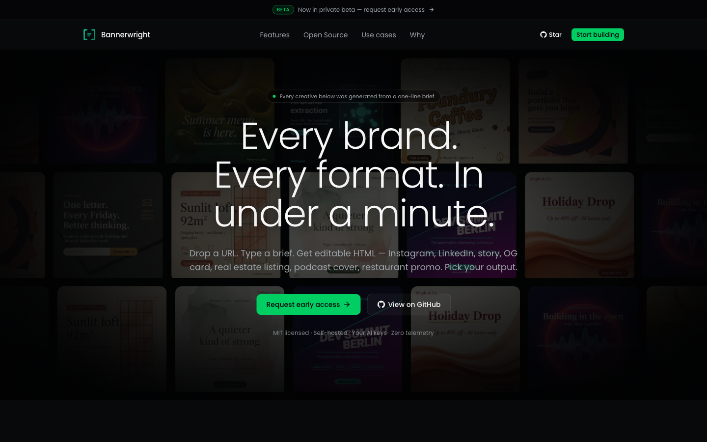
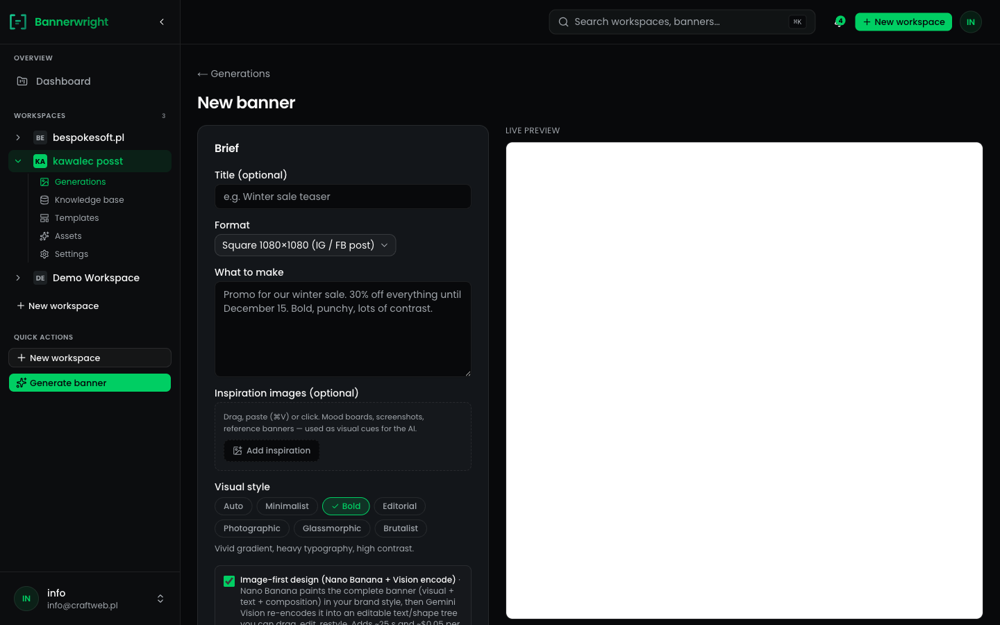
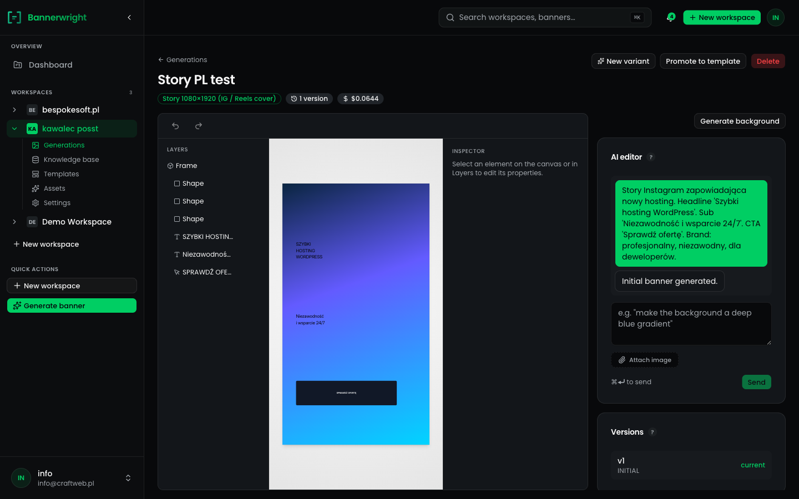
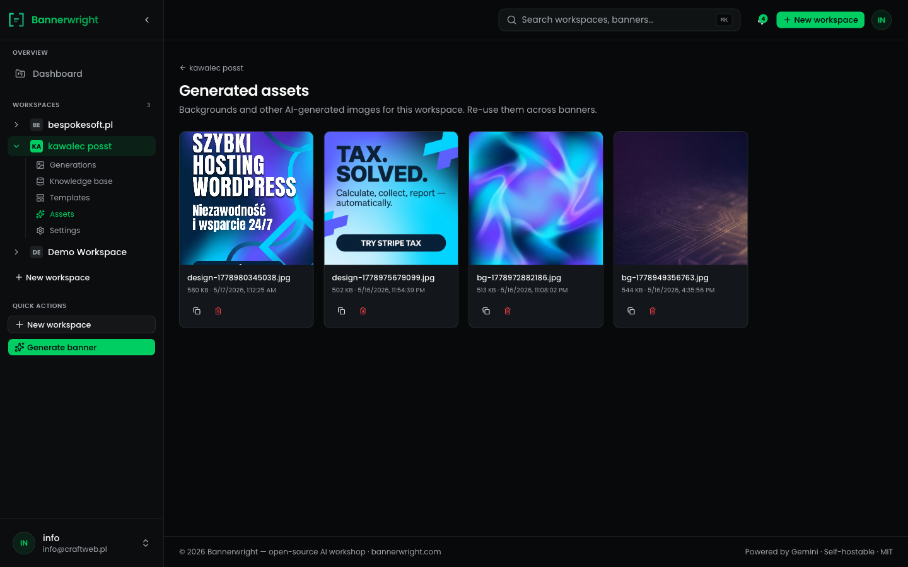
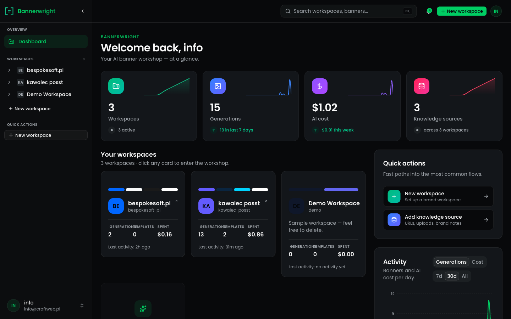
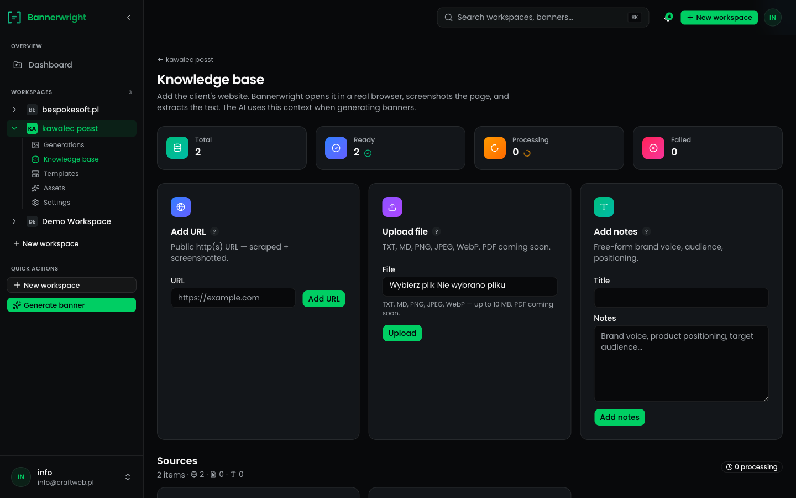

# Bannerwright

> A workshop for makers of banners. Self-hostable, open-source AI graphics generator that turns a brief + brand context into editable HTML banners (PNG export).



**Status:** [v0.1.0](https://github.com/dawidkawalec/bannerwright/releases/tag/v0.1.0) live in prod at [bannerwright.com](https://bannerwright.com). Image-first generation pipeline (Nano Banana paints the complete banner → Gemini 3 Pro Vision transcribes it into an editable BannerTree), seven style presets, four formats (square / story / landscape / portrait), brand knowledge base with URL → screenshot + auto-detect, tree editor with layers + chat + version history + mobile sheets, templates with parent lineage, generated-assets library, per-banner cost tracking, Polish/Latin diacritics handled in the prompt.

## What it looks like

| Generation form | Tree editor | Asset library |
|---|---|---|
|  |  |  |

| Dashboard | Knowledge base |
|---|---|
|  |  |

## Quickstart (self-hosted, prebuilt image)

```bash
# 1. Generate an admin password hash (locally or anywhere with Docker)
docker run --rm node:22-bookworm-slim sh -c "npm i -g @node-rs/argon2 >/dev/null && node -e \"require('@node-rs/argon2').hash('CHANGE_ME', { memoryCost: 19456, timeCost: 2, outputLen: 32, parallelism: 1 }).then(console.log)\""

# 2. Copy the example env and fill in the hash + session secret + Gemini key
curl -fsSLO https://raw.githubusercontent.com/dawidkawalec/bannerwright/main/.env.example
mv .env.example .env
# edit .env — set ADMIN_EMAIL, ADMIN_PASSWORD_HASH, SESSION_SECRET (openssl rand -hex 32), GEMINI_API_KEY

# 3. Pull and run with Postgres
curl -fsSLO https://raw.githubusercontent.com/dawidkawalec/bannerwright/main/docker-compose.prod.yml
docker compose -f docker-compose.prod.yml up -d
```

Open http://localhost:3000, sign in, drop a brand URL into Knowledge base, generate.

## Quickstart (clone + build)

```bash
git clone https://github.com/dawidkawalec/bannerwright.git
cd bannerwright
cp .env.example .env

# Generate the admin password hash and paste into .env (ADMIN_PASSWORD_HASH=...)
docker compose run --rm web pnpm tsx scripts/hash-password.ts CHANGE_ME

# Generate a session secret and paste into .env (SESSION_SECRET=...)
openssl rand -hex 32

# Drop your Gemini API key in .env (GEMINI_API_KEY=...) — get one at https://aistudio.google.com/

docker compose up -d db
docker compose run --rm web pnpm db:migrate
docker compose run --rm web pnpm db:seed
docker compose up
```

Open http://localhost:3000 and sign in.

## Local development

```bash
pnpm install
docker compose up -d db
pnpm db:migrate
pnpm db:seed
pnpm dev
```

## Project layout & conventions

- [AGENTS.md](AGENTS.md) — entrypoint for AI agents working on this codebase
- [PRD.md](PRD.md) — full product spec
- [docs/](docs/) — architecture, database, API, AI pipeline, deployment

## Contributing

See [CONTRIBUTING.md](CONTRIBUTING.md). Open an issue before non-trivial PRs.

## Roadmap & changelog

- [ROADMAP.md](ROADMAP.md) — where Bannerwright is and where it's going.
- [CHANGELOG.md](CHANGELOG.md) — release notes.
- [docs/development-phases.md](docs/development-phases.md) — phase-by-phase deliverables.

## License & trademark

Code under MIT (see [LICENSE](LICENSE)). The Bannerwright name and logo follow a Plausible/PostHog-style split — see [TRADEMARK.md](TRADEMARK.md). Security disclosures: [SECURITY.md](SECURITY.md).
